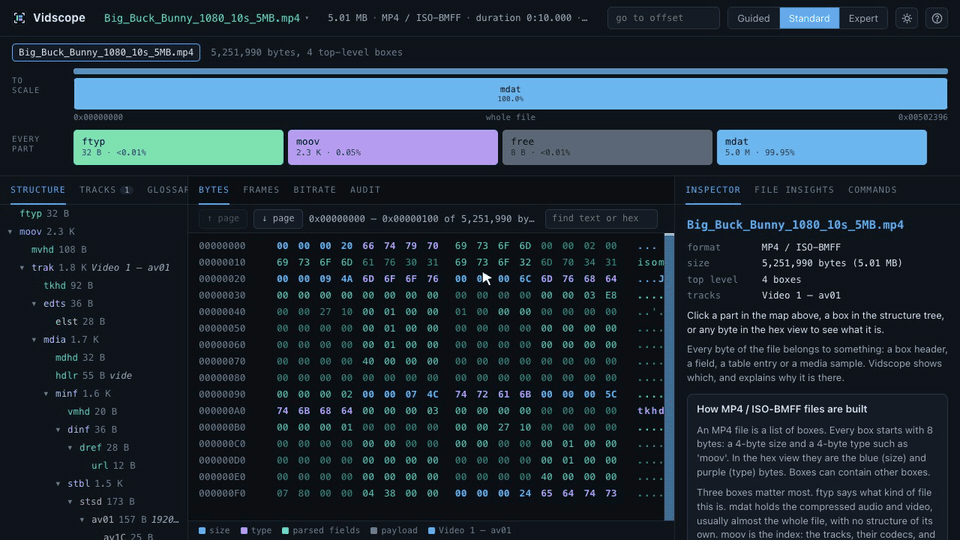
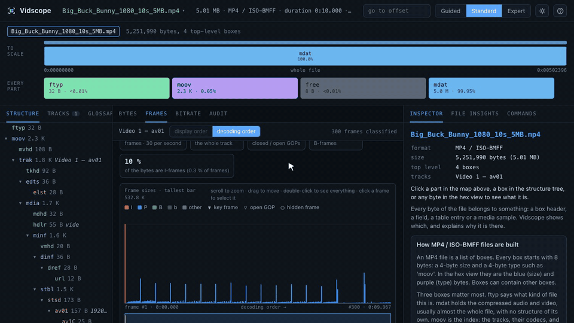
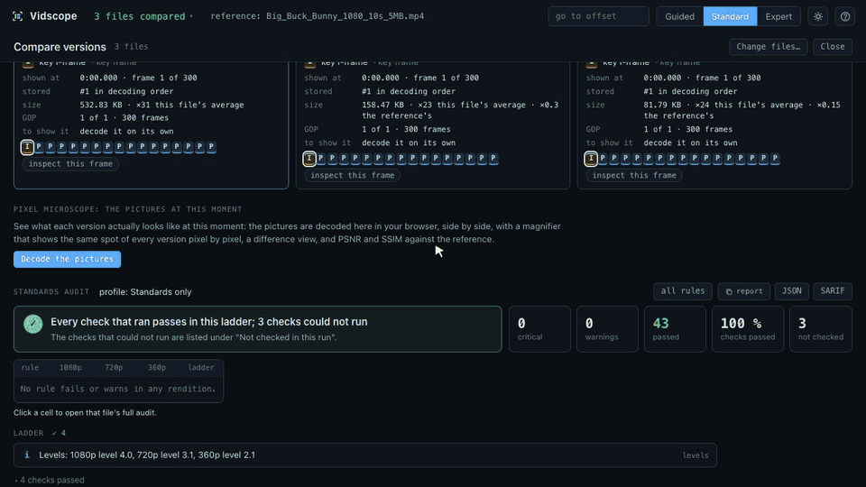
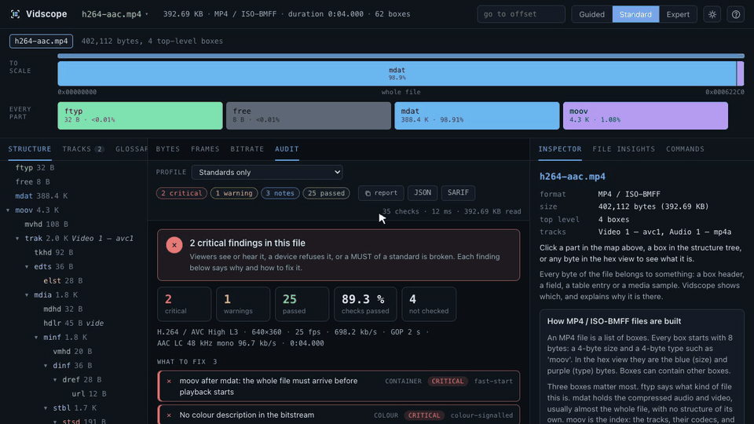
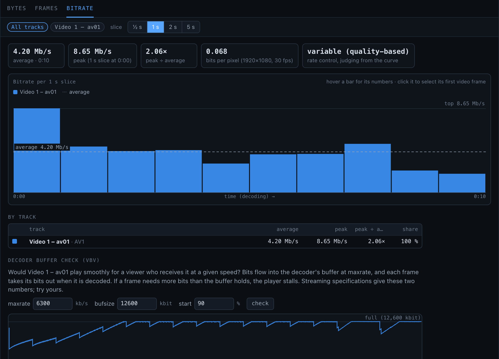
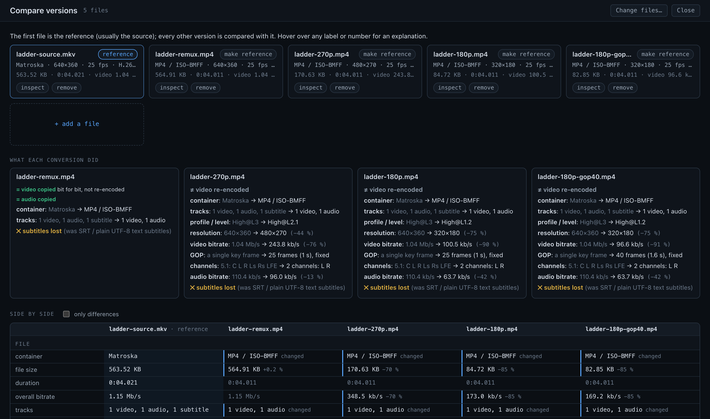
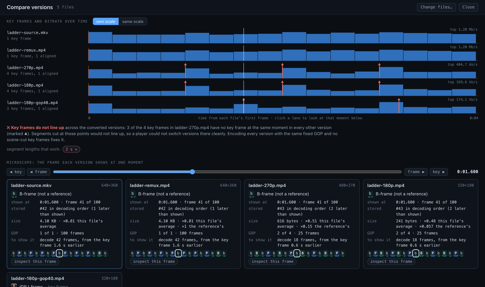
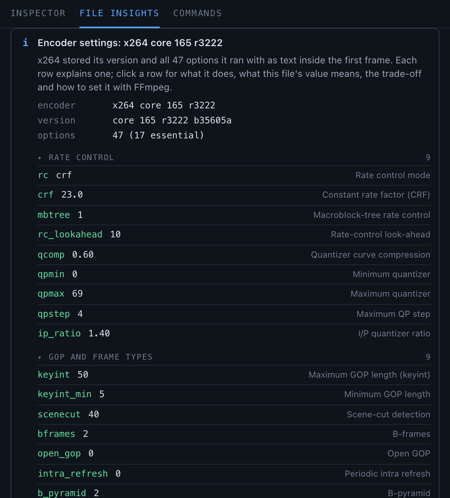
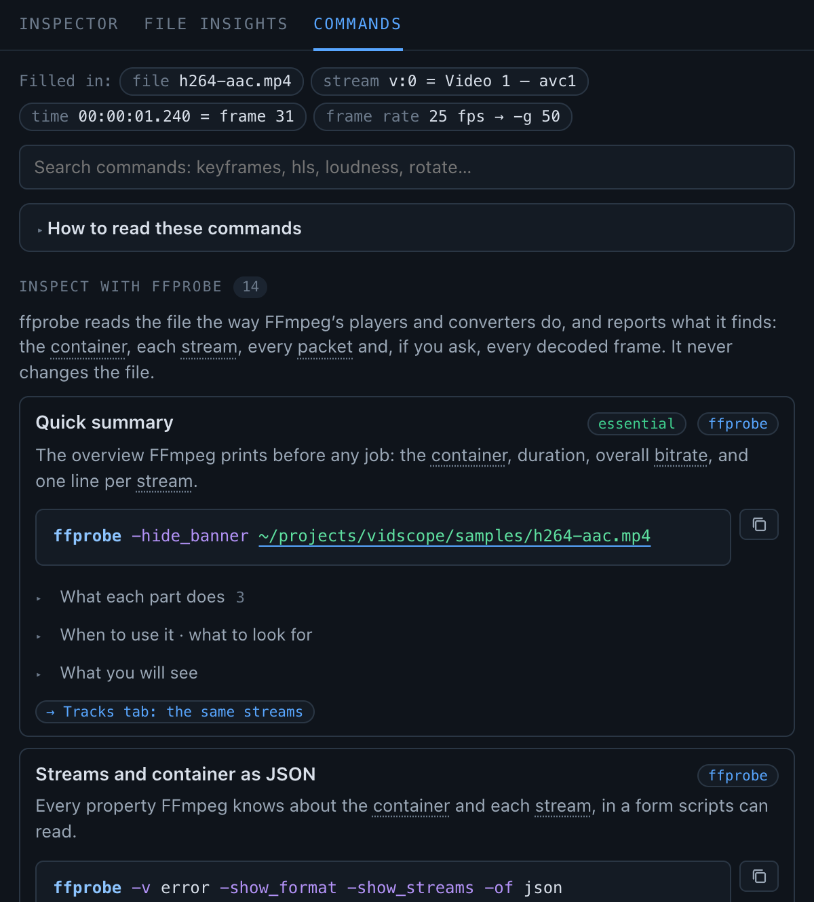

<p align="center">
  <picture>
    <source media="(prefers-color-scheme: dark)" srcset="docs/brand/logo-dark.png">
    
  </picture>
</p>

<p align="center">
  <b>See the bytes inside video files.</b><br>
  An anatomy viewer and a streaming-standards audit for MP4/MOV, Matroska/WebM, MPEG-TS, AVI and FLV.<br>
  It runs in your browser; nothing is uploaded.
</p>

<p align="center">
  <a href="https://github.com/Amahdip/vidscope/actions/workflows/test.yml"></a>
  <a href="https://amahdip.github.io/vidscope/"></a>
  <a href="LICENSE"></a>
  
  
</p>

<p align="center">
  <a href="https://amahdip.github.io/vidscope/">Try it</a> ·
  <a href="#quick-start">Quick start</a> ·
  <a href="#what-it-shows">What it shows</a> ·
  <a href="#auditing">Auditing</a> ·
  <a href="#formats">Formats</a> ·
  <a href="CONTRIBUTING.md">Contributing</a> ·
  <a href="CHANGELOG.md">Changelog</a>
</p>

<p align="center">
  
</p>

Vidscope maps every byte of a video file to the box, element, field, table entry or media
frame it belongs to, and explains in plain words what it is for. It classifies every frame,
charts the bitrate, compares a source with the versions converted from it down to the pixel,
and audits files, whole bitrate ladders and HLS presentations against Apple's HLS authoring specification,
RFC 8216, H.264, H.273, ISO 14496-12, EBU R 128 and ITU-R BT.1359.

## Quick start

You need [Node.js](https://nodejs.org) 18 or newer. Nothing else gets installed.

```bash
npx github:Amahdip/vidscope ~/Movies
```

This downloads Vidscope, starts a small server on your computer and opens
http://127.0.0.1:8766, listing the videos in `~/Movies`. Give it a file or a folder (`-r`
includes sub-folders), or no path at all and drop files onto the page.

No installation at all: open **[the hosted viewer](https://amahdip.github.io/vidscope/)** and
drop a file on it. Everything runs in your browser, and a multi-gigabyte file is read a few
bytes at a time from your disk.

To keep a copy or change the code:

```bash
git clone https://github.com/Amahdip/vidscope.git
cd vidscope
node bin/vidscope.js ~/Movies
```

No video at hand? `npm run samples` makes about 60 short test files in every format with
FFmpeg, and `npm start` opens them.

## What it shows

- **To-scale map** of the file and of any box you zoom into, plus one card per part so even
  8-byte boxes are clickable.
- **Structure tree** of every box, element, chunk, packet or tag, with track labels and
  warnings.
- **Hex view** over the whole file, of any size, coloured by structure: headers, parsed fields,
  table entries, and inside media payloads the frames of each track, down to the NAL units.
- **Inspector**: click any byte to see the field it belongs to as hex, decimal and binary, its
  type and byte range, what it means and where it sits, with the specification section, the
  [MP4 Registration Authority](https://mp4ra.org) entry and the official syntax.
- **Frames and NAL units**: a byte inside a media payload resolves to its frame (track, index,
  decode and presentation time, key frame, and the chunk, fragment, Cluster or PES packet it
  came in), split into NAL units, OBUs or audio frames with decoded headers: SPS/PPS/VPS, SEI
  (x264 settings, HDR metadata, captions), slice headers.
- **File insights**: fast start, fragmentation, interleaving, key-frame interval, B-frames,
  edit lists and audio priming, variable frame rate, HDR, encryption, the encoder and its
  settings, metadata, chapters and integrity problems, each with the FFmpeg command that fixes
  it. Per format: Matroska Cues, SeekHead and CRC-32s; TS timing (PCR, PAT/PMT repetition,
  continuity counters); AVI indexes; FLV metadata against the tags.
- **Frames view**: every frame as an I-, P- or B-frame, read from its own slice or frame header
  (H.264, HEVC, AV1, VP9, VP8, MPEG-2, MPEG-4 Part 2, Sorenson, VP6), grouped into GOPs, in
  decoding order next to display order.
- **Bitrate view**: bits per second of every track over time, average and peaks, bits per
  pixel, a guess at the rate control, and a decoder buffer (VBV) check for a given `-maxrate`
  and `-bufsize`.
- **Compare versions**: a source next to the versions converted from it. What each conversion
  changed or lost, whether the video was copied or re-encoded, the ladder's bitrates, whether
  key frames line up and which segment lengths work, and a **pixel microscope** that decodes the
  pictures in the browser (WebCodecs) side by side, with a difference view and PSNR and SSIM
  computed as FFmpeg's filters do.
- **Encoding explained**: the x264/x265 settings stored in the stream, each one explained; the
  rate control in one sentence (CRF, capped CRF, ABR, CBR, two-pass, constant QP); the preset
  the options match and an FFmpeg command that reproduces the encode; a check against the codec
  level's limits.
- **Commands**: the ffprobe, ffplay and ffmpeg commands that matter, to inspect, watch, fix and
  measure, filled in for the open file, the selected track and the selected frame's time.
- **Glossary** of concepts and of the open format's structures, marking what is in the file.
- **Guided, Standard and Expert** levels: Guided adds plain-language notes and explanations
  when you hover a term, Standard shows every field with a one-line description, Expert only
  values, offsets and bytes. Dark and light themes.

Everything is parsed in the browser. The server only hands out byte ranges, so opening a
multi-gigabyte file reads just its headers and index, and the hex view reads only what is on
screen. Dropped files are never uploaded.

## A look around

**Frames view**: every frame typed from its own header, grouped into GOPs, with each frame's
type, size, time and GOP under the pointer.



**Compare versions and the pixel microscope**: the same moment of a 1080p, 720p and 360p
conversion, decoded in the browser, with one magnifier on the same spot of each. 1080p keeps the
blades of grass, 720p softens them and 360p turns them into blocks.



**Audit**: the file judged against the standards, what to fix first, the source and clause of
each finding, the usual cause and the FFmpeg fix, and what could not be checked in this run.



**Bitrate view**: bits per second over time, the peaks, and the decoder buffer simulation.



**What each conversion changed**, and whether the versions can be switched between: here one
version has a 1.6 s GOP instead of 1 s, so its key frames do not line up.

<p>


</p>

**Encoding explained** and **Commands**: the encoder's own settings, each one explained, and
FFmpeg commands filled in for the open file and the selected frame.

<p>


</p>

<sub>The pictures come from <a href="https://peach.blender.org">Big Buck Bunny</a>, © 2008
Blender Foundation, <a href="https://creativecommons.org/licenses/by/3.0/">CC BY 3.0</a>. The
other files are test patterns made by <code>npm run samples</code>. The animations and the
overview are recorded by <code>scripts/capture/</code>.</sub>

## Auditing

### In the viewer

The **Audit** tab judges the open file: a verdict, "What to fix" ordered by severity, every
other check by category, and for each finding the standard and clause, what was measured
against what was expected, the usual cause and fix, and a jump to the bytes it is about. Checks
that apply but could not run (loudness without a measurement, fidelity without the source) are
listed as such, never counted as passes. A profile (a JSON file with the keys `--expect-file`
takes) adds what a service intends on top of the standards. The report copies as Markdown and
saves as JSON or SARIF. In **Compare**, the renditions of one video get a ladder audit: a
conformance matrix of rules against renditions and the checks across them.

**Audit standards**, on the start page and next to every report, opens the standards register
(`standards.html`): every rule the audit runs, the standard and item it cites with a link to the
official text, what the source says and what the audit checks, and how each citation was
verified. It is built from the engine's own rule list, so it cannot miss a rule.

Served next to an audit server that answers under `api/audit/` (a separate service that knows a
platform's registry and storage), the viewer also offers **Check a conversion**: type a video id
or a rendition URL, get the whole ladder audited, and open any rendition through the server's
byte proxy.

### From the command line

`vidscope audit` checks files, and renditions of one content (`movie-1080p.mp4`,
`movie-720p.mp4`, …) together as a ladder: about 50 rules, each with the item or clause it comes
from, a severity that follows it (a MUST broken is critical, a SHOULD a warning), the byte
offset it is about, and the FFmpeg change that usually fixes it. The few rules that are common
encoding practice rather than a standard say so; `--rules` lists them all with their sources.

```bash
node bin/vidscope.js audit --expect gop=5,fpsMax=60,colour=1/1/1 --md report.md movie-*.mp4
```

Inputs can be URLs: the index is read with HTTP range requests and only a budget of frame data
follows (`--budget <MB>`, 32 by default), so a long file costs a few megabytes, not a download.
`--expect` states what the service intends (GOP length, frame-rate range, colour description,
audio codec and sample rate, loudness target); without it the rules check only what the
standards say. `--json` writes a report ([docs/audit-report.schema.json](docs/audit-report.schema.json)),
`--sarif` a SARIF log, `--measure` adds FFmpeg loudness and, with `--source`, PSNR/SSIM against
the original. The exit code is 2 on a critical finding, 1 on a warning, 3 when an input could not
be audited.

`--decode` decodes every video and audio frame with FFmpeg, single-threaded (with frame threads
FFmpeg can let a damaged frame through unflagged), and reports each damaged frame with the moment
it is shown and a jump to its bytes. It finds what no structural check can: a payload damaged
inside intact boxes and tables. It reads the whole file, so it is off by default; encrypted
tracks are reported as not decoded.

An HLS playlist is audited as the presentation players receive. Give the multivariant (or a
media) playlist, a file or a URL, and Vidscope reads every media playlist behind it, measures the
size of every segment (HEAD requests, or one-byte range requests), opens a few segments with its
own parsers, and checks what the playlists declare against what is there: BANDWIDTH against the
peak segment bit rate as RFC 8216 defines it, AVERAGE-BANDWIDTH, CODECS, RESOLUTION and
FRAME-RATE against the segments, durations against the target, aligned boundaries, key frames at
segment starts, I-frame playlists and protocol versions. Signed URLs lose their query in every
report.

```bash
node bin/vidscope.js audit "https://cdn.example.com/show/master.m3u8" --md report.md
```

Segments are judged the way a packager cuts them: at the first key frame at or after each
multiple of the segment length, as FFmpeg's HLS muxer does. A GOP cut short anywhere in the file
(a join between the chunks of a chunked encode, a forced key frame) therefore shows up as the
long segment it causes, and the peak bit rate is that of the busiest segment, as HLS measures
BANDWIDTH.

What the audit does not do yet: it does not read DASH manifests, and without `--decode` it
checks structure and frame headers rather than decoding every frame.

## Running it

There are no dependencies and no build step: `bin/vidscope.js` serves the `web/` folder and the
byte ranges of the files you name.

```bash
node bin/vidscope.js ~/Movies/clip.mp4 ~/Videos
```

Folders are scanned for media files (`-r` to recurse). With no arguments you can drop files onto
the page, or open a path from the file menu. In a clone, `npm link` installs a `vidscope`
command. Options: `--port <n>` (default 8766; the next free port is used if taken), `--host
<addr>` (default 127.0.0.1), `--no-open`, `-r/--recursive`.

The server binds to localhost, answers only requests addressed to localhost (a DNS rebinding
guard), and only serves the files you named.

### On a static host

`web/` is the whole application. Copy it to any static host and Vidscope runs from there, with
the files visitors pick or drop: parsing, frame types, bitrates, comparisons and decoding for
the pixel microscope all happen in their browser. The repository publishes it to
[GitHub Pages](https://amahdip.github.io/vidscope/) on every push to `main`
(`.github/workflows/pages.yml`) and carries a `netlify.toml` for Netlify. Serve it over HTTPS
(or from localhost): browsers offer WebCodecs only in a secure context.

### Keyboard

| Key | Action |
| --- | --- |
| click a byte | identify it |
| `g` or `/` | go to offset: `1234`, `0x4D2`, `4D2h`, `1.5M`, `50%`, `-1k` (from the end) |
| `f` | find text (`mdat`, `x264`) or hex bytes (`00 00 01`); Enter finds the next match |
| arrows, PgUp/PgDn, Home/End | move the byte cursor (hex view focused) |
| `[` `]` | previous / next box at the same level |
| `u` | parent box |
| Enter / Backspace | zoom the map in / out |
| `1` `2` `3` | Guided / Standard / Expert |
| `?` | all shortcuts |

The URL keeps the file and selected offset (`?file=2#0x28`), so views can be shared between
people looking at the same files.

## Formats

| Format | What Vidscope reads |
| --- | --- |
| MP4, MOV, M4A, 3GP, fMP4/CMAF, HEIF/AVIF (ISO-BMFF) | 140+ box types with every field, sample entries for about 100 codecs and their configurations (avcC, hvcC, av1C, vpcC, esds, dOps, dac3, dec3, dfLa...), sample tables and fragments, iTunes/QuickTime metadata, HEIF items, Common Encryption; every sample located and split into NAL units / OBUs |
| Matroska, WebM (MKV, MKA, WebM) | All 273 elements of RFC 8794 / RFC 9559 with descriptions and section links, EBML variable-length integers decoded bit by bit, unknown-size (live) Segments and Clusters, CRC-32 checks, Block and SimpleBlock headers with Xiph/EBML/fixed lacing, CodecPrivate (avcC, hvcC, av1C, Vorbis/Theora headers, BITMAPINFOHEADER, WAVEFORMATEX), Cues, chapters, tags, attachments, subtitles (SRT, ASS); resynchronises after damaged bytes |
| MPEG transport stream (TS, M2TS/MTS, 188/192/204-byte packets) | Packet headers, adaptation fields (PCR, splice countdown, private data), PES headers (PTS/DTS), PSI/SI tables (PAT, PMT, CAT, NIT, BAT, SDT, EIT, TDT/TOT, SCTE-35) with CRC-32 checks and about 40 descriptors; frames reassembled across packets and split (ADTS, LATM, AC-3, E-AC-3, MPEG audio), with key frame detection |
| AVI, OpenDML, WAV, BWF, RF64 (RIFF) | hdrl, stream headers and formats, idx1 and OpenDML indexes, `movi` chunks (grouped, loaded lazily), AVIs without an index (scanned); WAV fmt/WAVE_FORMAT_EXTENSIBLE, bext, cue, smpl, iXML, ds64 and more, with the PCM sample frame or ADPCM block under the cursor decoded |
| FLV | Header, tags and PreviousTagSize checks, onMetaData (AMF0, including keyframe index arrays), AVC/HEVC/AV1/VP9 and AAC/Opus configuration records including Enhanced RTMP; resynchronises after damage |
| Raw video streams (H.264 and HEVC Annex B, MPEG-1/2 video: .h264, .264, .hevc, .265, .m2v) | Every NAL unit (or MPEG-2 header) decoded and grouped into frames the way a decoder does; key frames, picture types, display order rebuilt from the picture order count (or temporal reference), and the frame rate from the SPS VUI (or the sequence header); explains what an elementary stream lacks and how to wrap it without re-encoding |
| Anything else | Shown as bytes with the hex view and find; the signature is identified (MPEG-PS, Ogg, MXF, ASF, HLS playlists, raw AAC/MP3 streams, images...) |

Codec bitstreams: H.264 (SPS with VUI and HRD, PPS, SEI, slice headers), H.265 (VPS, SPS with
VUI, PPS, SEI, slice headers), AV1 (sequence and frame headers, OBUs), VP8/VP9 frame headers,
MPEG-4 Part 2 and MPEG-2 video headers, AAC (AudioSpecificConfig, ADTS, LATM), Opus,
AC-3/E-AC-3, FLAC, ALAC, MP3.

## How it fits together

```
bin/vidscope.js          local server: static UI + byte ranges of the files you pass
web/core/                byte sources with a block cache, FieldReader, the node tree, Doc,
                         frames, bitrate, comparison, the audit engine and its remedies
web/codecs/              codec configurations and bitstream headers (H.264, HEVC, AV1, VP9, audio...),
                         encoder settings (x264/x265) and codec level limits
web/formats/<format>/    one directory per container; see docs/FORMATS.md
web/ui/                  map, tree, hex view, inspector, insights, commands, tracks, glossary,
                         frames, bitrate, compare, audit
scripts/                 the audit CLI, dump.mjs, sample generation, capture of these images
```

Parsers record every value together with its exact byte (and bit) position through
`FieldReader`, so the inspector and the hex view always agree on which bytes a field occupies.
Emulation-prevention bytes in NAL units are removed before parsing and each field is mapped back
to its original bytes. The box registry comes from [mp4ra.org](https://mp4ra.org) and the
[MPEG File Format Conformance Framework](https://github.com/MPEGGroup/FileFormatConformance),
bundled in `web/formats/isobmff/registry-data.js` (`npm run registry` refreshes it).

## Development

```bash
npm run samples   # the test files, made with FFmpeg
npm test          # every located sample compared with ffprobe, and much more
node scripts/dump.mjs samples/h264-aac.mp4 --fields --tracks --insights --sample 0:0
```

Tests compare every sample Vidscope locates (offset, size, timestamps, key frame flag) with
FFmpeg's demuxer through `ffprobe`, check that the node tree is consistent, cover the server and
the audit, and run every command of the Commands tab against the samples. CI runs them with
FFmpeg 8.1 on every pull request.

Adding a container format is described in [docs/FORMATS.md](docs/FORMATS.md). Coding agents
find the development guide in [AGENTS.md](AGENTS.md) and task guides in
[`.agents/skills/`](.agents/skills): adding a format, writing audit rules, auditing and
inspecting files, and regenerating the images above.

## Contributing

Issues and pull requests are welcome: see [CONTRIBUTING.md](CONTRIBUTING.md). Please report
security problems privately, as described in [SECURITY.md](SECURITY.md).

## License

[MIT](LICENSE)
